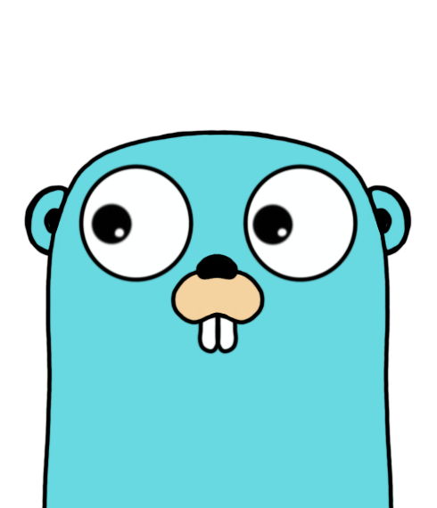

<h2>Hey 👋, I'm <a href="https://linktr.ee/brandao07">André</a></h2>

I'm a software engineer student from Portugal.

<h2> ⚡️ A Few Quick Facts </h2>
<ul>
<li>🎓 I’m currently a bachelor's finalist.</li>
<li>🐱‍👤 Learning about <strong>Golang</strong>, <strong>microservices architecture</strong>, and a bit of <strong>TypeScript</strong>.</li>
<li>🎵 I love music, it keeps me calm and focused.</li>
</ul>
<h2>🚀 Some Tools I Use</h2>

